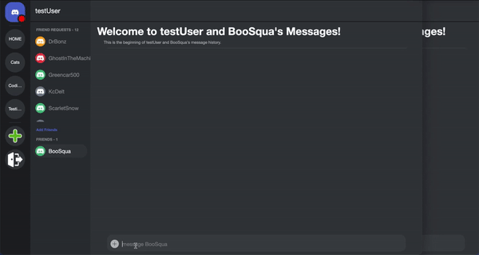
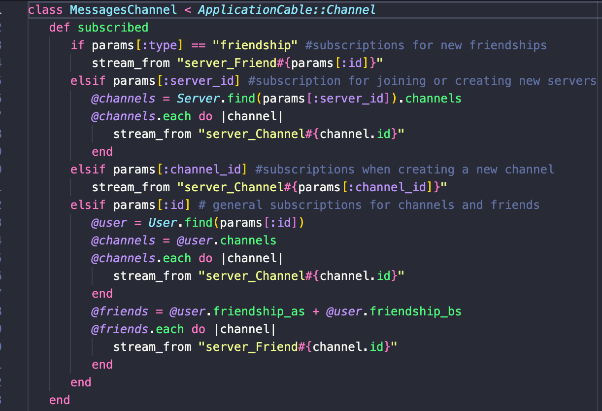
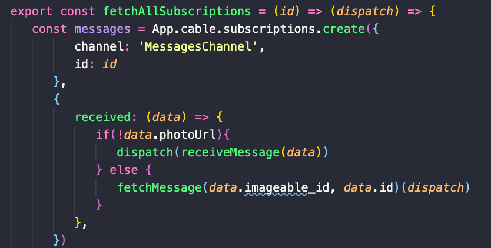
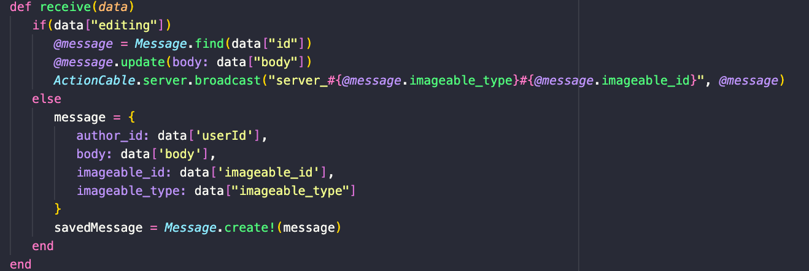
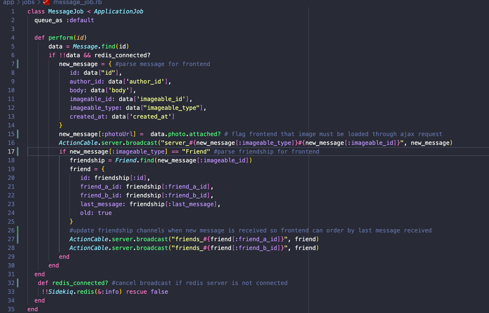
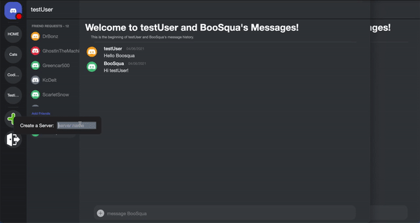
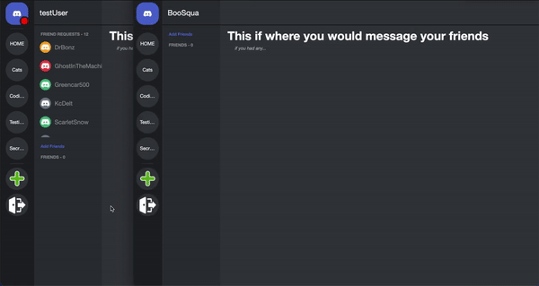
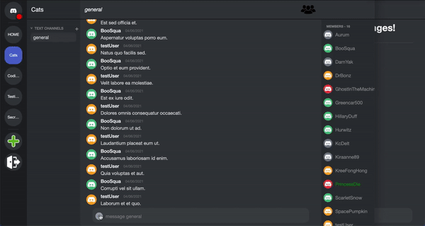
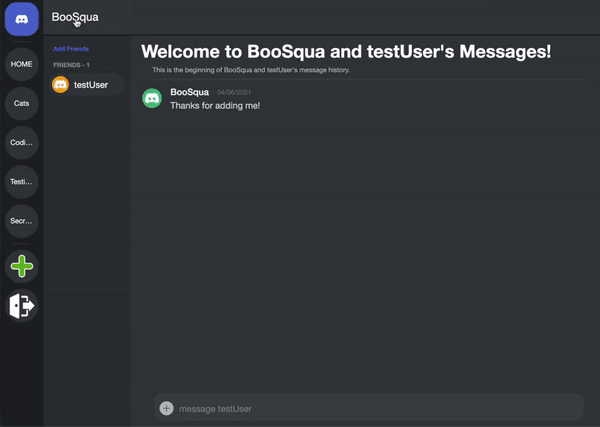

# README
***
## What is [Disorder?](https://dis-order.herokuapp.com/#/)

Disorder is a fullstack single-page web application that closely follows the design and features of the popular gaming live-chat system, Discord. Users can securely log in, create and edit servers and channels, and chat in real time with other logged-in users.

### Relevant Technologies
* Frontend
  * React-Redux - Javascript library with reusable UI components
  * Slate - Text editing library
  * HTML/CSS - style and formatting
* Backend
  * Ruby on Rails - MVC framework
  * ActionCable - Rails Websocket integration
  * PostgreSQL - database
  
## Features
   ### ActionCable
ActionCable allows users to receive messages, friend requests, and server invitations instantly
# Live Chat 
Users are able to chat in real-time with each other using channels.
# 
Live chat is the primary feature of this application. It utilizes Rails Action Cable, subscribing users to chat channels for servers and direct messages.
# 
Once a user has logged in, subscriptions to the messages channel are created and saved to the redux store.
# 
Whenever a user creates or edits a message, the frontend components send the message to the MessagesChannel. When the messages channel receives an edit, the message entry is updated and broadcast to the relevant channel. 
# 
If the message channel is creating a new message, the message is broadcast through MessagesJob perform method. This allows the backend to handle broadcasts for messages sent through the MessagesChannel or created through tradition Ajax requests. This method is used to account for messages containing images uploaded to AWS which cannot be handled through ActionCable.
# 

# Instant Server Invitations, Friend Requests, and Friend Updates with ActionCable
# 
# 

### SERVER
  Users are able to create, edit, and delete servers as well as upload an image from their local storage as a server's cover photo using AWS's S3 Storage System, securely saving their media.
# CHANNELS
Users are also able to create, edit, and delete channels within servers to diversify their conversation funnels.

### AWS
Thanks to AWS image hosting, users can upload images to message channels and customize their user and server icons.
# 
# 
# Reusable Components 
   ### Icon Button
Component that takes in styling props, props to trigger on hover transitions, and can contain either text or image links.
   ### Modal
Simple Modal component. Necessary props are handleClose, function, and show, boolean. Will align content at center of the page unless passed a position prop with x and y coordinates.
   ### Input Text
Renders text editing area using the Slate library. Accepts placeholder, text, and submit props. 

### Coming Soon to DisOrder
   * User updates channel: updates users and gives online status using action cable. 
   * Server updates channel: send information on channel creations and server image uploads.
   * Text formatting: change messages body column to accept Json objects to save Slate objects and preserve text formatting.
   * Emojis and message reactions.
   * Search feature: already in production, need to add new component and grid template area.
